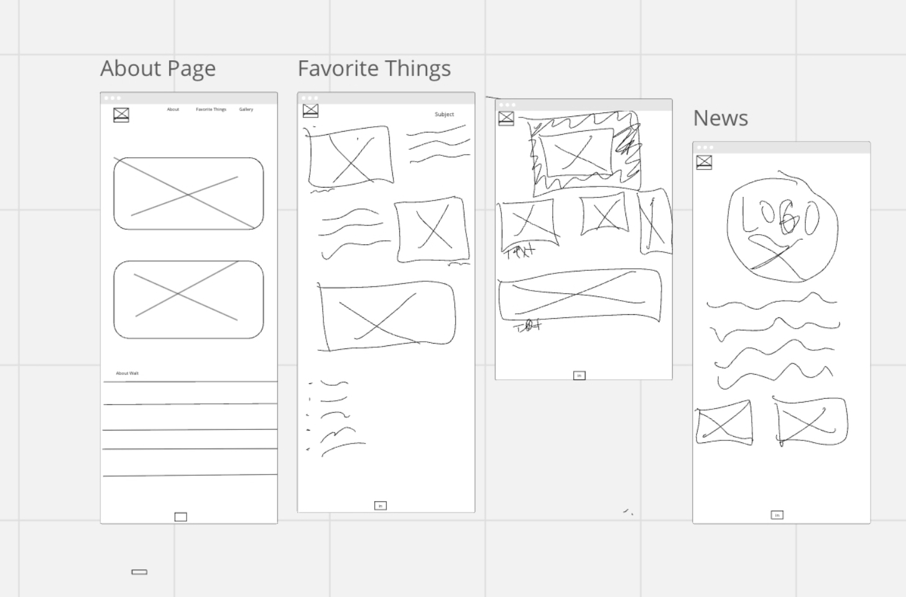

# Capstone1

This is a website built with Bootstrap/CSS/Html/JavaScript. It demonstrates a 

## About
This is a website about Me.

It contains four pages:
- About Me
- Gallery
- Favorite Things
- Store 

## Built With
* HTML
* CSS
* Bootstrap
* JavaScript

## Roadmap
- [x] Make a Branch
- [x] Html
- [x] CSS
- [x] JS
- [x] Bootstrap
- [x] Image Folder
- [x] About Me
- [x] Gallery
- [x] Added images to Gallery Html file
- [x] added cards to favorite page 
- [x] added flip card for main page with paragraph. and background image.
- [x] added links to favorites page
- [x] Store for rackets
- [x] added prices to store
- [x] added container div to favorite html
- [x] put cards in a grid 

## After Evaluation
 - [x] Fixed errors in css
 - [x] ID selector in CSS
 - [x] If Statement in JS

 ## Wireframe
 

Contact

**Author: Walter Sias, walt.sias@gmail.com**

**Acknowledgements**: Added html files, bootstrap CDN, also custom boostrap from w3 schools, and I used float and responsive utlities.
- [Bootstrap](https://getbootstrap.com/)
- [w3schoools CSS](https://www.w3schools.com/cssref)
- [w3schools JS](https://www.w3schools.com/js/)
- [mdn web docs](https://developer.mozilla.org/en-US/docs/Web/CSS/background-repeat)
- Robert McCreary - Classmate
- Louis Perkins - Classmate
- Desmon Garrison
- Nicholas Smith
- Completing this was a task. I had some time to overcome the grid, and I could still use some tweaks.

    ## After Evaluation: 
    After Speaking with Josue, I realized where I had the typo on my css code, It was a mistype. Also not adding the "if statement" in JavaScript, and ID selector in CSS, was an oversight. If my memory serves me right, I actually had an ID selector and when I changed my "ipsum Lorem" on the index.html page, I took it out. Those things have been added and updated to the Capstone.